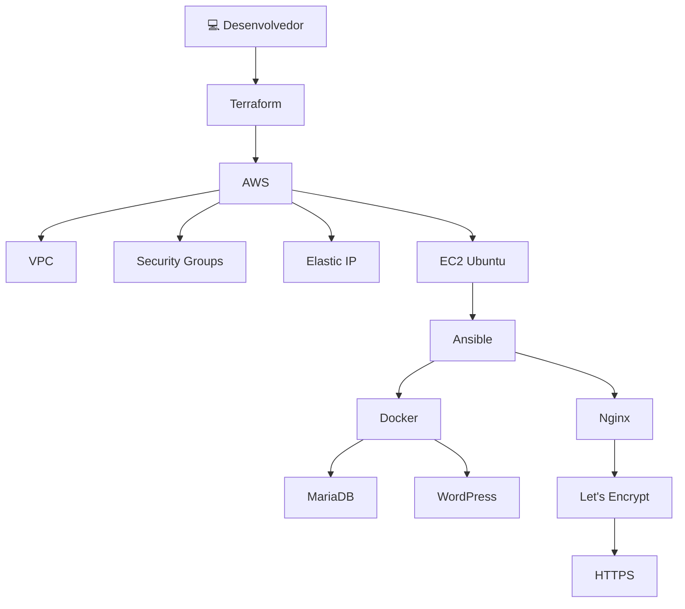
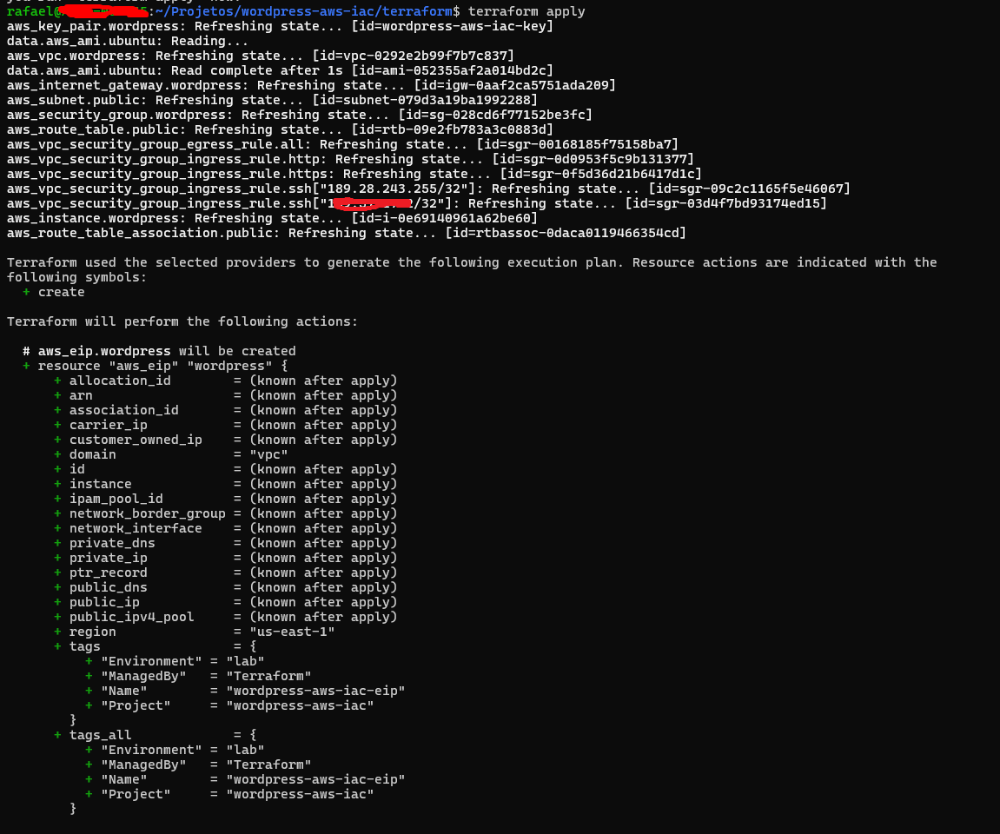
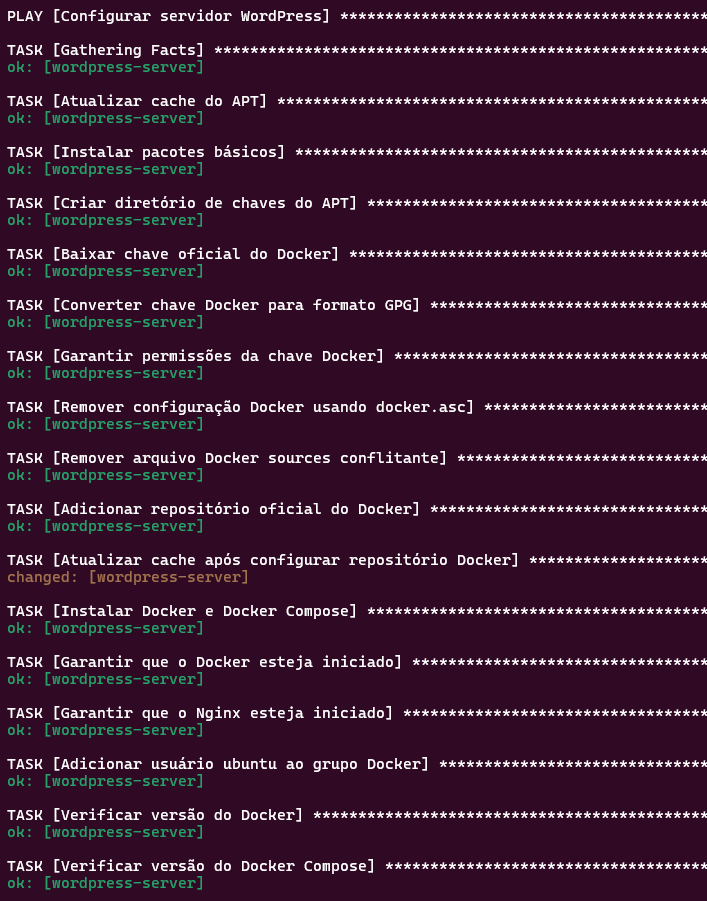
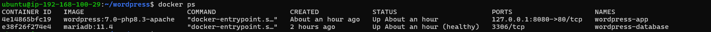
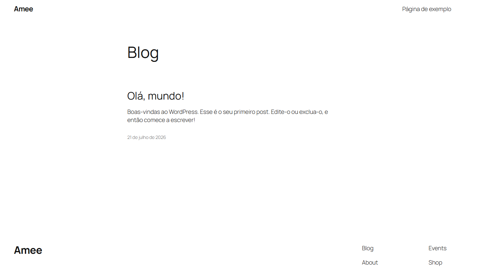
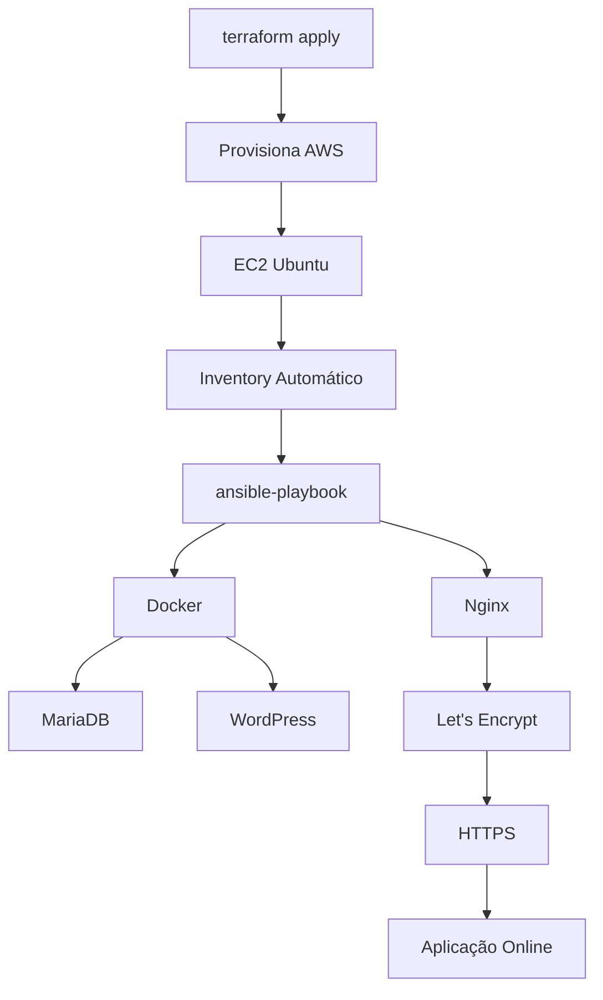

<div align="center">

# 🚀 WordPress AWS IaC

### Provisionamento automatizado de uma infraestrutura WordPress na AWS utilizando Terraform e Ansible

<p align="center">


</p>

---

### ☁️ Infraestrutura como Código • Automação • Cloud • DevOps

Projeto desenvolvido para demonstrar uma arquitetura moderna de **Infraestrutura como Código (IaC)**, automatizando completamente o provisionamento de um ambiente WordPress seguro na AWS utilizando **Terraform**, **Ansible**, **Docker**, **Nginx** e **Let's Encrypt**.

---

⭐ Caso este projeto seja útil para você, deixe uma Star no repositório.

</div>

---

# 📖 Sobre o Projeto

Em muitos ambientes corporativos, a criação de um servidor para hospedar uma aplicação ainda é realizada manualmente.

Isso normalmente envolve:

- Criar uma máquina virtual;
- Configurar regras de firewall;
- Instalar Docker;
- Instalar banco de dados;
- Configurar Nginx;
- Configurar HTTPS;
- Ajustar permissões;
- Configurar serviços manualmente.

Além de consumir tempo, esse processo torna o ambiente difícil de reproduzir e sujeito a erros humanos.

O objetivo deste projeto foi eliminar completamente esse processo manual utilizando **Infraestrutura como Código (IaC)**.

Com apenas dois comandos:

```bash
terraform apply
```

e

```bash
ansible-playbook playbooks/site.yml
```

é possível criar automaticamente toda a infraestrutura necessária para disponibilizar um ambiente WordPress totalmente funcional na AWS.

---

# 🎯 Objetivos

Este projeto foi desenvolvido para simular um cenário próximo ao encontrado em ambientes corporativos.

Os principais objetivos foram:

- Provisionar infraestrutura na AWS utilizando Terraform;
- Automatizar toda configuração do servidor utilizando Ansible;
- Disponibilizar um ambiente WordPress utilizando Docker;
- Configurar MariaDB automaticamente;
- Configurar Nginx como Reverse Proxy;
- Emitir certificados SSL automaticamente utilizando Let's Encrypt;
- Garantir idempotência dos playbooks;
- Facilitar futuras implantações;
- Demonstrar boas práticas de Infraestrutura como Código.

---

# ✨ Principais Recursos

✔ Provisionamento completo utilizando Terraform

✔ Configuração automática utilizando Ansible

✔ Infraestrutura reproduzível

✔ Docker e Docker Compose

✔ MariaDB

✔ WordPress

✔ Nginx

✔ HTTPS automático

✔ Certificados Let's Encrypt

✔ Inventário Ansible gerado automaticamente

✔ Elastic IP

✔ Security Groups

✔ SSH por chave pública

✔ Organização modular

✔ Templates Jinja2

✔ Variáveis protegidas com Ansible Vault

---

# 🏗 Arquitetura



---

# 🧱 Arquitetura da Solução

```
                     Terraform
                          │
                          ▼
                Provisionamento AWS
                          │
     ┌──────────────────────────────────┐
     │                                  │
     │         Amazon EC2               │
     │                                  │
     │ Ubuntu Server                    │
     │ Docker                           │
     │ Docker Compose                   │
     └───────────────┬──────────────────┘
                     │
               Ansible Playbook
                     │
      ┌──────────────┼──────────────┐
      ▼              ▼              ▼
   MariaDB      WordPress       Nginx
                                      │
                                      ▼
                              Let's Encrypt
                                      │
                                      ▼
                                 HTTPS
```

---

# ⚙ Tecnologias Utilizadas

| Tecnologia | Finalidade |
|------------|------------|
| Terraform | Provisionamento da infraestrutura |
| AWS EC2 | Servidor Linux |
| AWS VPC | Rede |
| AWS Security Groups | Firewall |
| Elastic IP | Endereço IP público |
| Ubuntu Server | Sistema Operacional |
| Ansible | Automação |
| Docker | Containers |
| Docker Compose | Orquestração |
| MariaDB | Banco de Dados |
| WordPress | CMS |
| Nginx | Reverse Proxy |
| Let's Encrypt | Certificados SSL |
| Certbot | Automação HTTPS |
| Ansible Vault | Proteção das variáveis sensíveis |

---

# 📂 Estrutura do Projeto

```text
aws-wordpress-iac/

├── terraform/
│   ├── providers.tf
│   ├── variables.tf
│   ├── outputs.tf
│   ├── network.tf
│   ├── security-group.tf
│   ├── ec2.tf
│   ├── ansible_inventory.tf
│   └── terraform.tfvars.example
│
├── ansible/
│   ├── inventory/
│   ├── group_vars/
│   ├── playbooks/
│   ├── templates/
│   ├── roles/
│   └── ansible.cfg
│
├── docs/
│   ├── images/
│   ├── gifs/
│   └── diagrams/
│
├── README.md
└── .gitignore
```

---

# 🎯 Fluxo Geral

```text
Terraform

        │

Provisiona AWS

        │

Cria EC2

        │

Gera Inventory

        │

Ansible conecta via SSH

        │

Atualiza Ubuntu

        │

Instala Docker

        │

Instala Docker Compose

        │

Cria Containers

        │

Configura MariaDB

        │

Configura WordPress

        │

Configura Nginx

        │

Solicita SSL

        │

Site disponível via HTTPS
```

---

# 📌 Motivação

Durante meus estudos em Cloud e DevOps, percebi que muitos exemplos encontrados na internet mostram apenas partes isoladas da solução.

Este projeto foi desenvolvido para reunir em um único repositório diversas tecnologias utilizadas em ambientes reais, automatizando todo o processo de implantação de uma aplicação WordPress na AWS utilizando Infraestrutura como Código.

Além de servir como laboratório de estudos, o objetivo é demonstrar uma abordagem organizada, reproduzível e próxima das práticas adotadas em equipes de infraestrutura, plataforma e DevOps.
# ☁️ Provisionamento da Infraestrutura (Terraform)

O Terraform é responsável por provisionar toda a infraestrutura base na AWS.

Em vez de criar recursos manualmente pelo Console da AWS, toda a infraestrutura é descrita em código, permitindo recriar ambientes de forma rápida, consistente e versionada.

## Recursos Provisionados

Durante a execução do comando:

```bash
terraform apply
```

são criados automaticamente os seguintes recursos:

| Recurso | Finalidade |
|----------|------------|
| VPC | Rede privada da infraestrutura |
| Internet Gateway | Permitir acesso à Internet |
| Route Table | Configuração de rotas |
| Security Groups | Firewall da instância |
| Elastic IP | IP público fixo |
| EC2 Ubuntu | Servidor da aplicação |
| Key Pair | Autenticação SSH |
| Inventory Ansible | Geração automática do inventário |

---

## Estrutura Terraform

```text
terraform/

providers.tf
variables.tf
network.tf
security-group.tf
ec2.tf
outputs.tf
ansible_inventory.tf
```

Cada arquivo possui uma responsabilidade específica.

### providers.tf

Define:

- Provider AWS
- Região
- Backend (quando utilizado)

---

### variables.tf

Centraliza todas as variáveis do projeto.

Exemplos:

- Região
- Tipo da instância
- Nome do projeto
- CIDR da VPC
- SSH
- Tags

Essa separação facilita reutilização e manutenção.

---

### network.tf

Responsável por criar toda a camada de rede.

São configurados:

- VPC
- Subnet Pública
- Internet Gateway
- Route Table
- Associação da Route Table

---

### security-group.tf

Cria o firewall da aplicação.

As portas abertas atualmente são:

| Porta | Serviço |
|-------|----------|
| 22 | SSH |
| 80 | HTTP |
| 443 | HTTPS |

O acesso SSH pode ser limitado ao IP do administrador.

---

### ec2.tf

Provisiona automaticamente:

- EC2 Ubuntu
- Elastic IP
- Associação do Elastic IP
- User Data (quando necessário)

A instância é criada pronta para ser configurada pelo Ansible.

---

### outputs.tf

Exporta informações importantes do ambiente.

Exemplos:

- IP Público
- DNS Público
- ID da Instância

Esses valores podem ser utilizados por outras ferramentas.

---

### ansible_inventory.tf

Um dos diferenciais deste projeto.

Após a criação da infraestrutura, o Terraform gera automaticamente o arquivo de inventário do Ansible.

Exemplo:

```ini
[wordpress]

wordpress-server ansible_host=XXX.XXX.XXX.XXX

[wordpress:vars]

ansible_user=ubuntu
ansible_ssh_private_key_file=~/.ssh/wordpress-aws
```

Dessa forma não é necessário editar manualmente o inventory sempre que uma nova EC2 for criada.

---

# 🤖 Automação com Ansible

Após a criação da infraestrutura, o Terraform entrega automaticamente o controle para o Ansible.

O Ansible é responsável por transformar uma instalação limpa do Ubuntu em um ambiente completamente funcional para hospedar aplicações WordPress.

Toda a configuração acontece de maneira automática.

---

## Fluxo do Playbook

```text
Conecta na EC2

↓

Atualiza Ubuntu

↓

Instala Docker

↓

Instala Docker Compose

↓

Cria diretórios

↓

Renderiza Templates

↓

Sobe MariaDB

↓

Sobe WordPress

↓

Configura Nginx

↓

Solicita Certificado SSL

↓

HTTPS Ativo
```

---

## Organização do Projeto

```text
ansible/

inventory/

group_vars/

playbooks/

templates/

roles/
```

A estrutura foi organizada para facilitar futuras expansões do projeto.

---

## Playbook Principal

O playbook principal é responsável por orquestrar toda a configuração do servidor.

Entre suas principais responsabilidades estão:

- Atualização do sistema
- Instalação de dependências
- Configuração do Docker
- Configuração do Docker Compose
- Deploy dos containers
- Configuração do Nginx
- Configuração do HTTPS

Tudo ocorre em uma única execução.

---

## Templates Jinja2

Ao invés de copiar arquivos estáticos para o servidor, o projeto utiliza templates Jinja2.

Isso permite gerar arquivos dinamicamente conforme as variáveis do ambiente.

Entre os principais templates estão:

- compose.yaml.j2
- nginx-wordpress.conf.j2
- wordpress.env.j2

Essa abordagem facilita reutilização da infraestrutura em diferentes ambientes.

---

## Variáveis

As variáveis utilizadas pelo projeto ficam centralizadas em:

```text
group_vars/wordpress/
```

Separando:

- Configurações gerais
- Credenciais
- Domínio
- Imagens Docker

Isso reduz duplicação de código e melhora a manutenção.

---

## Proteção das Credenciais

As informações sensíveis não ficam armazenadas diretamente nos playbooks.

Foi utilizado:

- Ansible Vault

para proteger:

- Senhas do banco
- Senha Root
- Email do Certbot

Assim, informações críticas permanecem criptografadas.

---

# 🐳 Containers Docker

A aplicação é executada utilizando Docker Compose.

Foram definidos dois serviços principais.

## MariaDB

Responsável pelo armazenamento dos dados da aplicação.

Características:

- Persistência de dados
- Volume dedicado
- Health Check
- Inicialização automática

---

## WordPress

Container responsável pela aplicação.

Características:

- PHP 8.3
- Apache
- Integração automática com MariaDB
- Persistência dos arquivos
- Configuração automática

---

## Benefícios da utilização do Docker

- Isolamento da aplicação
- Facilidade de atualização
- Portabilidade
- Reprodutibilidade
- Deploy simplificado
- Ambientes consistentes

---

# 🌐 Reverse Proxy com Nginx

O Nginx atua como Reverse Proxy da aplicação.

Suas responsabilidades incluem:

- Receber conexões HTTP
- Receber conexões HTTPS
- Encaminhar requisições ao container WordPress
- Gerenciar certificados SSL
- Redirecionar HTTP → HTTPS

Essa arquitetura é amplamente utilizada em ambientes de produção.

---

# 🔒 HTTPS Automático

Um dos principais objetivos deste projeto foi eliminar configurações manuais relacionadas ao SSL.

Durante o playbook são executadas automaticamente as etapas:

- Instalação do Certbot
- Solicitação do certificado
- Configuração do Nginx
- Redirecionamento HTTP → HTTPS
- Configuração da renovação automática

Todo o processo ocorre sem intervenção manual.

---

# ♻️ Idempotência

Todo o projeto foi desenvolvido seguindo um dos principais conceitos do Ansible:

> O playbook pode ser executado diversas vezes sem comprometer o ambiente.

Isso significa que:

- Recursos existentes não são recriados desnecessariamente.
- Configurações são preservadas.
- O ambiente permanece consistente.

Essa característica torna o projeto seguro para atualizações futuras.

---
# 📸 Resultado Final

Após a execução dos playbooks, o ambiente fica totalmente operacional.

## Infraestrutura Provisionada

- ✅ Amazon EC2
- ✅ Elastic IP
- ✅ Security Groups
- ✅ Ubuntu Server
- ✅ Docker
- ✅ Docker Compose
- ✅ MariaDB
- ✅ WordPress
- ✅ Nginx
- ✅ HTTPS
- ✅ Certificados SSL

---

## Terraform



---

## Ansible



---

## Docker



---

## WordPress



---

## HTTPS


---

# 📈 Fluxo Completo da Solução



---

# 🔍 Decisões de Arquitetura

Durante o desenvolvimento do projeto algumas decisões foram tomadas para tornar a infraestrutura mais organizada e reutilizável.

## Terraform responsável apenas pela Infraestrutura

O Terraform cria exclusivamente os recursos da AWS.

Isso inclui:

- Rede
- Firewall
- Instância EC2
- Elastic IP
- Inventory do Ansible

Toda configuração do sistema operacional foi delegada ao Ansible.

Essa separação reduz o acoplamento e segue uma prática comum em ambientes corporativos.

---

## Ansible responsável pela Configuração

Toda a configuração do servidor foi implementada utilizando Ansible.

Entre elas:

- Docker
- Docker Compose
- MariaDB
- WordPress
- Nginx
- HTTPS

Essa separação torna o projeto mais organizado e facilita futuras manutenções.

---

## Templates Dinâmicos

Ao invés de copiar arquivos estáticos, o projeto utiliza Templates Jinja2.

Benefícios:

- Reutilização
- Padronização
- Facilidade para múltiplos ambientes
- Menor duplicação de código

---

## Inventário Automático

Após a criação da infraestrutura o Terraform gera automaticamente o Inventory utilizado pelo Ansible.

Dessa forma não existe nenhuma configuração manual entre as duas ferramentas.

---

# 🚧 Desafios Encontrados

Durante o desenvolvimento alguns desafios surgiram.

## Integração Terraform + Ansible

Inicialmente era necessário editar manualmente o arquivo Inventory sempre que uma nova EC2 era criada.

A solução foi automatizar sua geração utilizando o recurso `local_file` do Terraform.

---

## HTTPS

Outro desafio foi automatizar completamente a emissão dos certificados SSL.

Era necessário garantir que:

- Certificado fosse criado apenas quando necessário.
- Nginx não tivesse sua configuração sobrescrita em novas execuções.
- O HTTPS permanecesse funcional após múltiplos deploys.

A solução adotada tornou o playbook completamente idempotente.

---

## Organização do Projeto

O projeto foi reorganizado diversas vezes até atingir uma estrutura modular.

Hoje a separação entre:

- Terraform
- Templates
- Variáveis
- Playbooks

facilita bastante futuras evoluções.

---

# 🧠 Conhecimentos Aplicados

Durante o desenvolvimento foram utilizados conceitos relacionados a:

- Infraestrutura como Código
- Cloud Computing
- Linux
- Docker
- Containers
- Reverse Proxy
- HTTPS
- Automação
- Provisionamento
- DevOps
- Redes
- Firewall
- Templates
- Versionamento
- Infraestrutura Reproduzível

---

# 📊 Próximas Evoluções

Este projeto continuará evoluindo.

Entre as melhorias planejadas estão:

- Integração com AWS Secrets Manager
- Pipeline CI/CD utilizando GitHub Actions
- Deploy automático do WordPress
- Backup automático para Amazon S3
- Monitoramento utilizando Prometheus
- Dashboards Grafana
- Health Checks
- Alertas
- Auto Scaling
- Load Balancer
- Amazon RDS
- Multi Environment (Dev / Homolog / Produção)

---

# 🚀 Roadmap

| Status | Funcionalidade |
|---------|----------------|
| ✅ | Terraform |
| ✅ | EC2 |
| ✅ | Security Groups |
| ✅ | Elastic IP |
| ✅ | Inventory Automático |
| ✅ | Docker |
| ✅ | MariaDB |
| ✅ | WordPress |
| ✅ | Nginx |
| ✅ | HTTPS |
| ✅ | Let's Encrypt |
| ✅ | Ansible Vault |
| 🔄 | AWS Secrets Manager |
| 🔄 | GitHub Actions |
| 🔄 | Deploy Automático WordPress |
| 🔄 | Backup S3 |
| 🔄 | Prometheus |
| 🔄 | Grafana |
| 🔄 | Application Load Balancer |
| 🔄 | Amazon RDS |

---

# 🛠 Possíveis Melhorias

Embora o ambiente esteja totalmente funcional, existem diversas possibilidades de evolução.

Algumas delas incluem:

- Utilização de módulos Terraform reutilizáveis.
- Criação de ambientes DEV/HML/PRD.
- Integração com AWS Route53.
- Criação automática de snapshots.
- Utilização de Docker Secrets.
- Utilização do AWS Secrets Manager.
- Pipeline GitOps.
- Testes automatizados dos Playbooks.
- Deploy Blue/Green.
- Migração para Kubernetes.

---

# 📚 Referências

- Terraform Documentation
- Ansible Documentation
- Docker Documentation
- AWS Documentation
- Nginx Documentation
- Let's Encrypt
- Certbot

---

# 👨‍💻 Autor

## Rafael Barboza

Analista de Infraestrutura | Cloud | DevOps | Observabilidade

Profissional com experiência em ambientes Linux, Windows Server, bancos de dados, monitoramento e infraestrutura em nuvem.

Atualmente aprofundando conhecimentos em:

- AWS
- Terraform
- Ansible
- Docker
- Kubernetes
- Observabilidade
- CI/CD
- DevOps

---

### GitHub

https://github.com/Raffilds

### LinkedIn

https://www.linkedin.com/in/SEU-LINK

---

# ⭐ Gostou do projeto?

Se este projeto contribuiu para seus estudos ou serviu como referência, considere deixar uma **⭐ Star** no repositório.

Além de apoiar o projeto, isso ajuda outras pessoas a encontrarem este material.

---

<div align="center">

## Obrigado pela visita! 🚀

*"Infrastructure as Code is not just automation. It is repeatability, reliability and confidence."*

</div>
